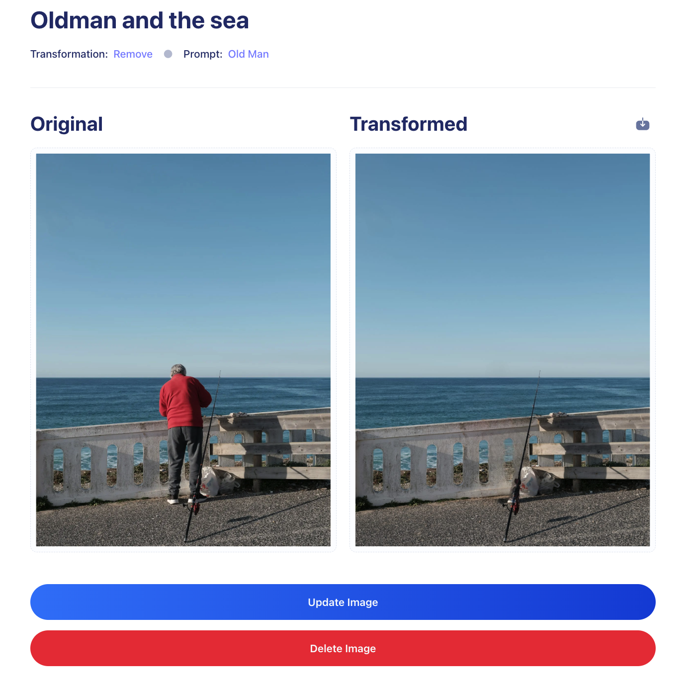

# ArtLens AI

ArtLens AI is an advanced image processing application built using **Next.js**, **Clerk**, **Cloudinary**. The platform enables users to apply powerful AI-driven features like image restoration, recoloring, object removal, generative filling, and background removal to their images.

## Demo
You can try a live demo of ArtLens AI [here](https://art-lens-ai.vercel.app/)


## Motivation

With the growing need for advanced image editing tools, ArtLens AI aims to provide an intuitive platform for users to enhance their images effortlessly. Whether it's for personal use, professional design, or creative projects, ArtLens AI offers a range of features to meet the diverse needs of image manipulation and restoration.


## Installation

  ```bash
    git clone https://github.com/ngnamquoc/ArtLens-AI.git
    cd ArtLens-AI
    npm install
    npm run dev
```
## Features

* Image Restoration: Restore old or damaged images to their original quality.
* Recoloring: Transform black-and-white images into vibrant, colorized versions.
* Object Removal: Remove unwanted objects seamlessly from images.
* Generative Filling: Fill in missing portions of images using AI-based predictions.
* Background Removal: Isolate the subject from the background for easy compositing.

## Architecture Overview
* Next.js
* TypeScript 
* TailwindCSS
* Shadcn
* MongoDB
* Clerk
* Cloudinary
* Stripe

## Front-End Design
The front-end is built with Next.js and TailwindCSS, providing a smooth user experience for uploading, processing, and downloading images. The app is responsive and works across a variety of devices.



## Future Improvements
* Add additional image processing features, such as style transfer and image upscaling.
* Improve AI processing speed and accuracy for faster image restoration and recoloring.
  


